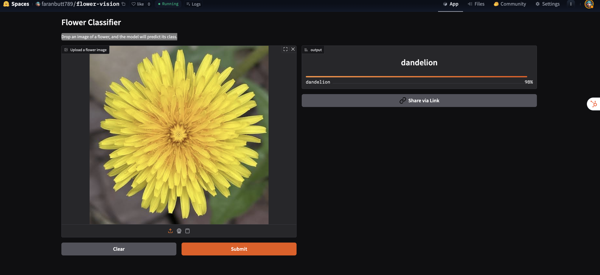

# 🌸 Flower Vision – Flower Classification with PyTorch & Optuna

**Live Demo:** [Hugging Face Space](https://huggingface.co/spaces/faranbutt789/flower-vision)

Flower Vision is a deep learning project for classifying flower images. The model uses **ResNet18**, optimized via **Optuna** hyperparameter tuning, and is deployed on Hugging Face Spaces for interactive use.

---

## Table of Contents
- [Project Overview](#project-overview)
- [Dataset](#dataset)
- [Data Cleaning & Preprocessing](#data-cleaning--preprocessing)
- [Model Architecture](#model-architecture)
- [Training & Hyperparameter Tuning](#training--hyperparameter-tuning)
- [Evaluation](#evaluation)
- [Visualization](#visualization)
- [Deployment](#deployment)
- [Usage](#usage)
- [Files](#files)
- [Acknowledgements](#acknowledgements)
- [License](#license)

---

## Project Overview
Flower Vision classifies images of 5 types of flowers using PyTorch. It includes:
- Data cleaning from CSV files
- Custom PyTorch Dataset & DataLoader
- ResNet18 pretrained backbone with custom classifier
- Hyperparameter optimization with Optuna
- Model evaluation and visualization
- Deployment to Hugging Face Spaces

---


## Dataset
- 5 flower classes: Daisy, Dandelion, Rose, Sunflower, Tulip
- Images stored in `/flowers_5_jpeg/flower_photos/`
- Separate CSV files for train and evaluation sets
- Cleaned CSVs ensure only valid paths are used

---

## Data Cleaning & Preprocessing
- CSVs are cleaned using a custom function to verify local image paths
- Images resized to **224x224**
- Normalized using standard ImageNet mean and std
- Custom PyTorch `FlowersDatasetV1` handles image loading and label encoding

---

## Model Architecture
- Backbone: **ResNet18** pretrained on ImageNet
- Classifier head:
  - Dropout (tunable)
  - Fully connected layer to 5 classes
- Optimized using CrossEntropyLoss
- Hyperparameters optimized via **Optuna**:
  - Learning rate
  - Batch size
  - Dropout
  - Optimizer choice (Adam/SGD)

<p align="center">

</p>

---

## Training & Hyperparameter Tuning
- Training uses **early stopping** to prevent overfitting
- Data split: 80% train, 20% validation
- Optuna searches for the best combination of hyperparameters
- Best model checkpoint is saved as `flower_checkpoint.pth`

---

## Evaluation
- Evaluated on cleaned test set
- Metrics reported:
  - Evaluation Loss
  - Accuracy
- Example evaluation output:
```text
Evaluation Loss: 0.3456
Evaluation Accuracy: 0.9123
```

---

## Visualization
- Predicted vs True labels are visualized
- Correct predictions: **green**, Incorrect predictions: **red**

Example:

<p align="center">
  
</p>

---

## Deployment
- Model checkpoint and metadata uploaded to Hugging Face Hub
- Interactive demo available: [Flower Vision Space](https://huggingface.co/spaces/faranbutt789/flower-vision)
- Users can upload images and get real-time predictions


---
## Acknowledgements

I found these resources useful (while developing this one):

* [Residual Networks (ResNet) and ResNeXt](https://d2l.ai/chapter_convolutional-modern/resnet.html)
- [PyTorch](https://pytorch.org/)
- [Optuna](https://optuna.org/)
- [Hugging Face Hub](https://huggingface.co/)
- Dataset from the *Practical Machine Learning for Vision* book
---


## Citation

If you find this code useful, please cite the following:

```
@misc{Flower-VisionFaranButt2025,
  author = {Faran Taimoor, Butt},
  title = {Flower-Vision-Resnet},
  year = {2025},
  publisher = {GitHub},
  journal = {GitHub repository},
  howpublished = {\url{https://github.com/faranbutt/Flower-Vision}},
}
```


---

## License
This project is licensed under the [MIT License](https://opensource.org/licenses/MIT).

---


